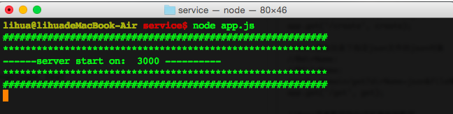
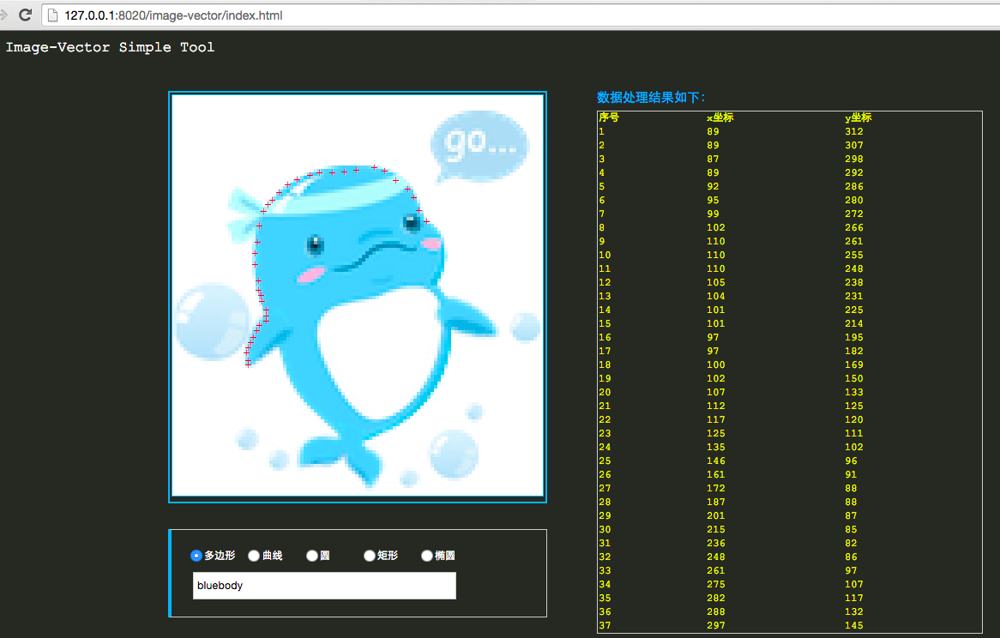
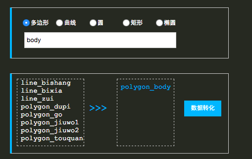
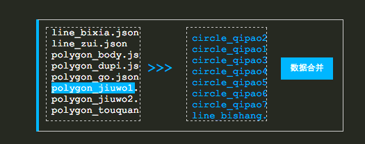
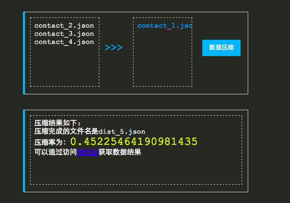

image-vector
----------------
将图片转化为矢量并canvas化的简单工具(基于Node.js + HTML5 canvas)

###一、矢量化的方案

	现有情况下，矢量化的方案主要有两种(这里只针对canvas)：
	1、基于要素图层的矢量，这也是大多数情况下的矢量，这样可以很好做拓扑关系；
	2、基于描述性的矢量，就是没有图层关系，只是表明坐标点范围内是什么颜色的地块。
	
###二、如何选择
	基于图层要素的矢量，可以很好的处理拓扑关系，如果数据量很小的情况下，可以采用该方案；但是如果数据量
	巨大比如一幅地图数据，那么使用图层要素叠加的话，势必会多出很多坐标点去描述空间的事物的完整性，因此，
	这个时候选择描述性的矢量是最为便捷的方案。
	
###三、为何canvas而非svg
	1、canvas和svg的选择是基于业务形态决定的；比如为了更好的交互，而不想自己定义交互行为，比如要素的
	选择，那么尽管使用是svg吧；
	2、在数据量很大的时候，svg的节点和属性就会占有很大的空间，如果在移动端canvas是一个更好的选择；
	3、没有交互，只有动画，数据量不大，我们希望更少的字节，那么大胆的使用canvas吧
	
###四、项目介绍
	工具主要由pc web端和node.js服务端组成；工具很简单，主要是采点的工具，这里我建议是采用基于要素图
	层的矢量，因为该工具很简单，只适合于一般图形文件的矢量化。
	1、服务端介绍
	node.js作为脚本处理工具，主要处理数据，使得数据方便我们canvas绘图使用。以下是暴露的服务接口，这
	里统一使用了get方式，方便调试。
	
	//des:创建点文件
	//@x:横坐标
	//@y:纵坐标
	//@fileName:需要保存的文件名
	//url: domain/create?x=112&y=678&fileName=polygon_text
	app.get('/create', create);
	
	//des:获取目录下指定json文件的json对象
	//@dirName:
	//@fileName:
	//url: domain/get?dirName=json&fileName=polygon_text
	app.get('/get', get);
	
	//des:将点数据转化成可用坐标数据
	//@fileNames:当isMany传入参数为1的时候，fileNames＝file1@file2@file2的形式;
	//否则只为fileNames=fileName
	//[@isMany]:当需要处理多文件的时候传入
	//url:domain/compile?fileNames=xxx[&isMany=1]
	app.get('/compile', compile);
	
	//des:列出目录下面的文件
	//@dirName:目录名称
	//url:domain/dir?dirName=xxx
	app.get('/dir', dir);
	
	//des:数据合并
	//@fileNames:多文件，以@分割，例如fileNames＝file1@file2@file2
	app.get('/contact', contact);
	
	//des:数据压缩
	//@fileName需要压缩的文件名
	//url:domain/dist?fileName=xxx
	app.get('/dist', dist);
	
	2、pc客户端
	pc客户端调用的是node.js提供的服务，因此，简单的数据处理使用pc客户端即可。

###五、如何使用
	1、 启动服务
	（1）默认已经安装好node.js & 使用npm 
	（2）$ git clone https://github.com/vczero/image-vector.git
	（3）$ cd image-vector/service
	（4）$ npm install
	（5）$ node app.js (启动服务，如果app.js中修改了端口；则相应修改js/main.js中DOMAIN_URL)
	（6）浏览器访问http://127.0.0.1:3000/，如下图，即成功：
	  

	2、启动pc客户端
	（1）点击image-vector/index.html即可访问工具的首页
	（2）这时你会看见一只海豚，当然你可以选择自己的图片；修改index.html中
	的图片即可，建议小图标放大4倍。
	
	3、数据处理
	（1）第一步：
	选中单选按钮，比如选中“多变形”，那么采集点就会按照闭合多边形采集；输入文件名，比如“bluebody“蓝色的身
	体，那么服务端就会生成对应的polygon_bluebody的文件；鼠标移入到蓝色的边框中，在需要采集点的“海豚身体”
	上采集点，如下图，就会出现红色“＋”字和右边的点位信息

	
	(2)矢量完成后，刷新页面，服务端生成的数据格式如下,存放在service/data/xxx
		89	312
		89	312
		91	307
		91	303
		90	299
		90	294
		91	289
		92	284
	（3）将相应的坐标点位数据生成可以测试使用的json格式，点击将右边的数据添加至右边，点击数据转化。生成的数
	据文件存放在server/json/polygon_body.json.可以通过URL访问：
	http://127.0.0.1:3000/get?dirName=json&fileName=polygon_body
		
	
	（4）可以再回到第一步，处理接下来的其他数据图层；如果处理完成，需要对所有的json文件合并，则可以使用数据
	合并功能, 如下图。文件存放在service/contact/目录下：

	（5）如果想更好的减少流量，可以进一步的压缩，使用数据压缩功能，这里是简单的压缩，建议依旧业务进一步处理，
	比如长位数据变短位；减少key的字节大小等。可以点击链接获取压缩完成的数据。

	
###五、使用canvas绘制Demo
	点击image-vector/ctrip.html即可看到矢量化的海豚，这个是坐标点放大4倍，canvas再缩小4倍的结果，看着，
	是不是有点儿逼真...

	
	canvas代码很简单，主要将数据分图层渲染。
	（1）定义了对应图层的颜色表：
		//颜色对应表
		var COLOR_LIST = {
			BODY: '#63CEF6',
			DUPI: '#FFF',
			EYE: '#034E68',
			ZUIBA: '#0089B5',
			TOUQUAN: '#BDF9FB',
			JIUWO: '#FFBFE3',
			QIPAO: '#C9E8FB',
			BISHANG: '#46BEEF',
			BIXIA: '#54C5F2',
			GO: '#B1DBF2'
		};
	（2）定义多边形、线、圆、文字等绘制规则；这一块主要基于服务返回的数据结构调整
		//draw polygon
		function drawPolygon(data, part, color){		
			addDrawFunc(data, part, color, function(xys){
				context.moveTo(xys[0], xys[1]);
				for(var i = 2; i < xys.length; i++){
					if(i % 2 !== 0){
						context.lineTo(xys[i-1], xys[i]);
					}
				}
			});
		}
	
###六、注意事项
	（1）数据压缩有比较多的方案，一般基于业务；
	（2）这里只是一个简单的工具，辅助将图片绘制成canvas；
	（3）如果需要高精度的矢量化，建议放大原有素材x倍密集采点，再canvas绘制完成后缩小x倍；
	（4）其实很多大图片的动画效果可以使用canvas来做；
	（5）采点的过程中，浏览器一定不要滚动，也不要缩放；一般你看到你点击的位置正好出现了红色的“＋”字说明一切
	正常，可以采点。

